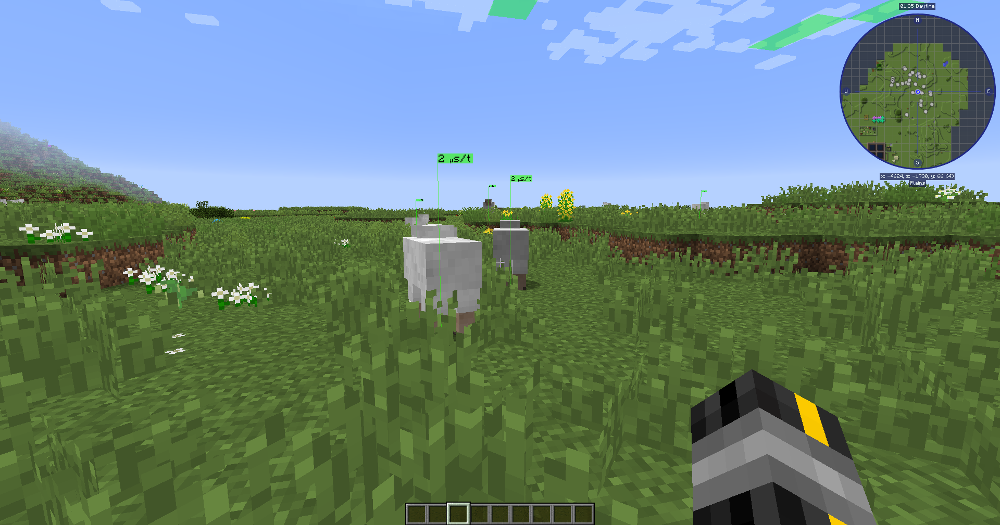

# LagGoggles 
Intuitive lag hunting!

# Notice: For versions above 5.3 you need to have [TickCentral](https://www.curseforge.com/minecraft/mc-mods/tickcentral/) installed!
TickCentral provides the functionality to be compatible with Mixin, and is intended to work across various Minecraft versions. I have decided to move away from Mixin because I noticed a lot of people having versioning issues with it. (One mod requiring version X, another shipping version Y, Change in behavior in version Z...)

LagGoggles is a profiler where you can see timings in the world, visually. It comes with a custom GUI using a configurable keybind. It's compatible with [SpongeForge](https://github.com/SpongePowered/SpongeForge) and [Mixin](https://github.com/SpongePowered/Mixin).

You can use LagGoggles as a player too! This is my attempt to create an understanding of what causes lag on a server to regular players.
I noticed some common misconceptions like having machines spread out over different chunks causes less lag than putting it in one chunk.
With LagGoggles, you can look around and see that alot of small things like pipes or cables cause a tiny bit of lag most of the time, often resulting in more lag than a machine right next to the source would.

LagGoggles can also profile clientside FPS as of version 4.0! Note that this only works on rendering entities.

### Download: [here](https://minecraft.curseforge.com/projects/laggoggles/files)

## Screenshots

| LagGoggles enabled | normal view |
| --- | --- |
|  |  |
|  |  |
|  |  |

## Video explaining the concept
Massive thanks to [Grok DuckFarmer](https://www.youtube.com/channel/UCoKMLbTK35pzF8Lv_oj3KlA) for making this video.

[Minecraft Talk 35 - LagGoggles and Better Server Play](https://youtu.be/2ALrIvw1S4I)

## Features
* Teleporting to sources of lag
* Client GUI, including overlay and clickable menus
* Colour scale for easy spotting of sources of lag.
* Calculations are done on the client, so each client can have a different colour scale.
* Clientside FPS support
   * Checks render time for Entities, Tile entities and event subscribers
   * It's very primitive, but it should give some insight in what may cause FPS issues.
* Config for client:
    * Custom gradients
    * Colorblindness support
* Config for server
    * Custom permissions for players (non-operators)

## Configuration
* Drop the jar in the /mods folder
* Make sure you have [TickCentral](https://www.curseforge.com/minecraft/mc-mods/tickcentral/) installed. Try the latest version you can find first.
* Serverside configuration is done through `LagGoggles-server.cfg`
* Clients can edit the config in-game to change the colour scale.

## How it works
Entities, blocks and event-subscribers are timed using `System.nanotime()` before and after the `tick()` and `update()` methods. These times are recorded and sent to the client when the profiler is done.

## Benefits
* Visualisation of various sources of lag
* Learn your players to build lag-free bases.

## Dependencies
 * [TickCentral](https://www.curseforge.com/minecraft/mc-mods/tickcentral)

## Incompatible
 * [Tiquality](https://www.curseforge.com/minecraft/mc-mods/tiquality)

## Contributing
 * Submit a pull request!
 * If you have suggestions, I will take them into consideration. Please note my time is extremely limited. Pull requests are the way to go here.