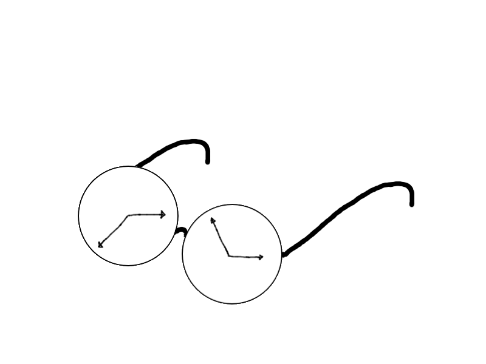
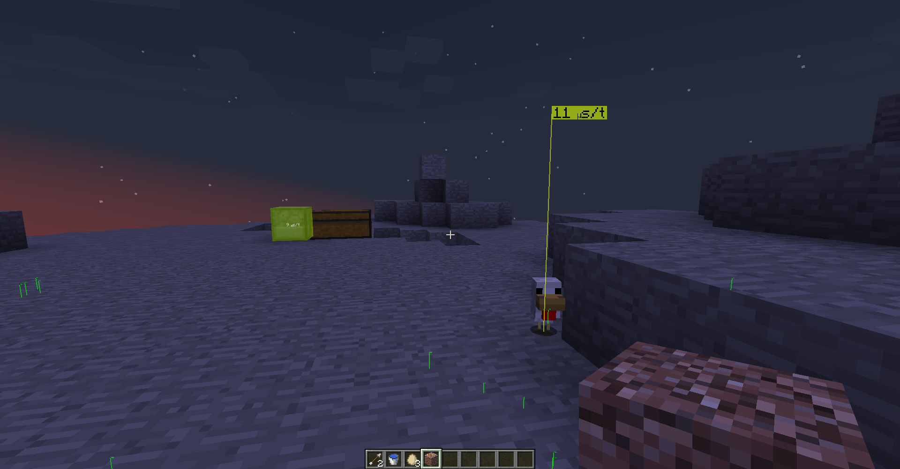
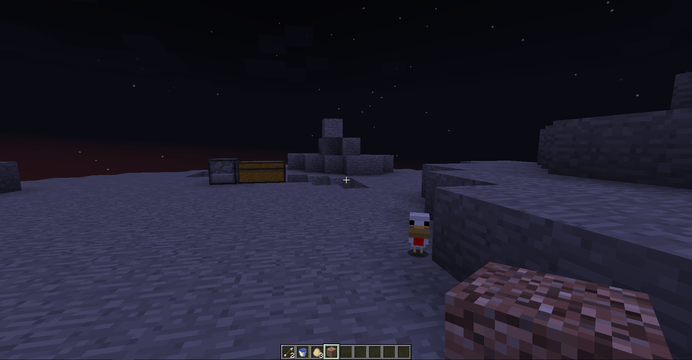
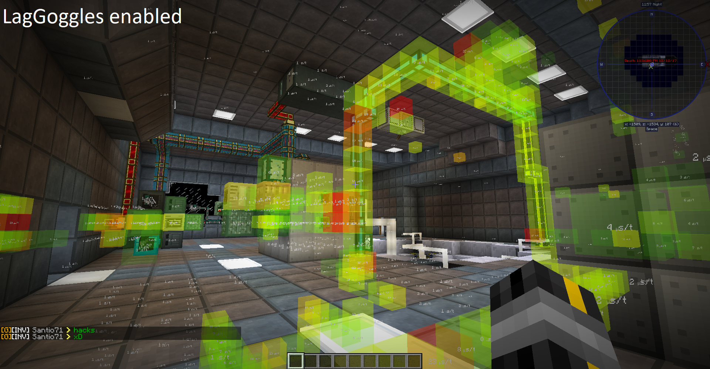
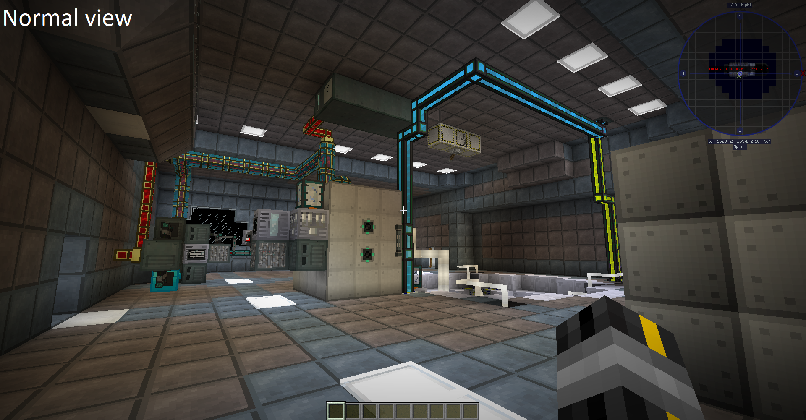
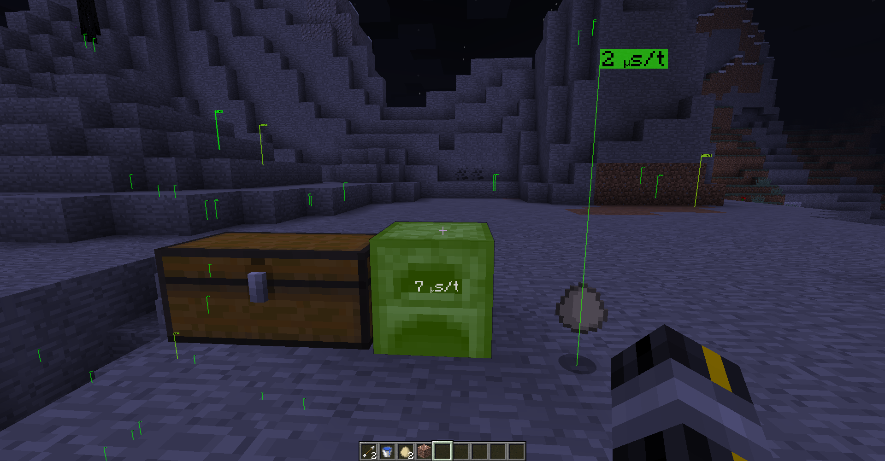
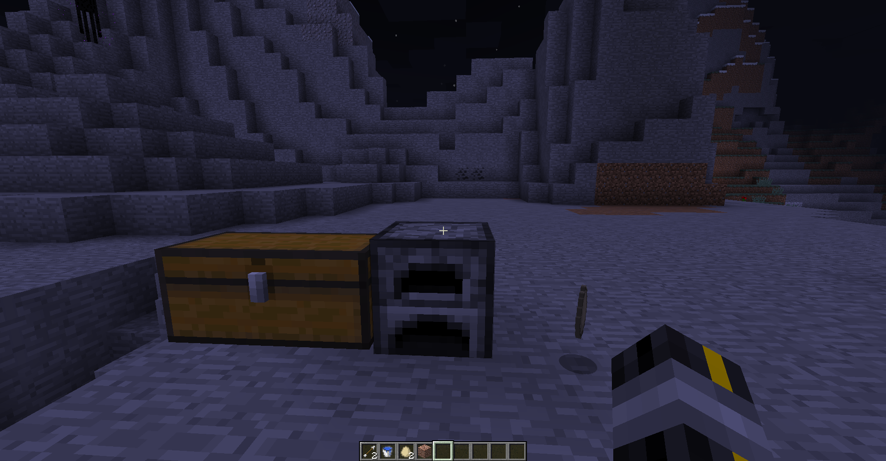
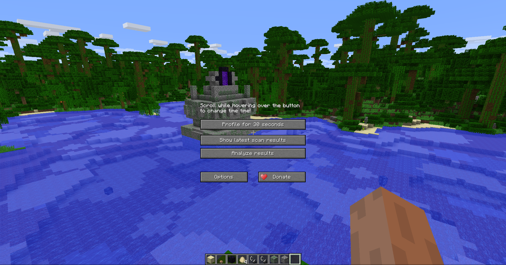
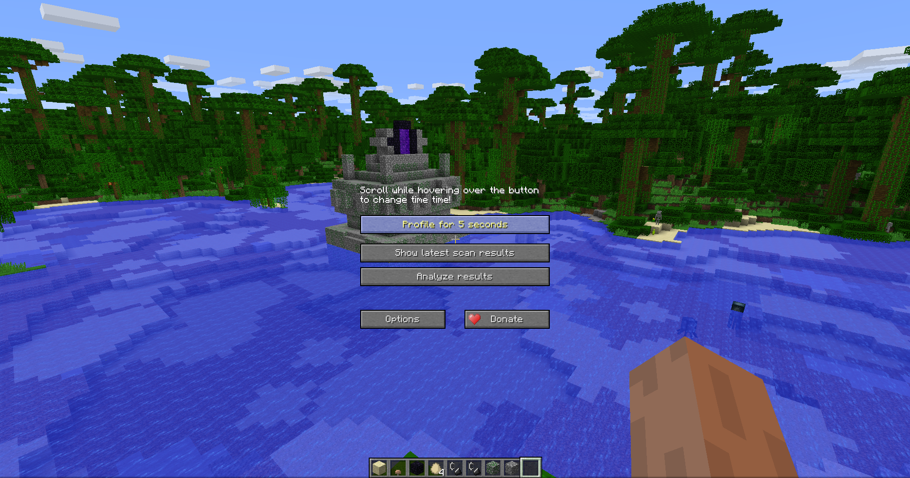
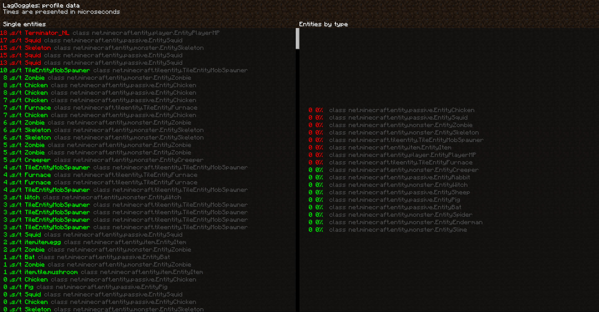

# LagGoggles 
Intuitive lag hunting! 
 
LagGoggles is a profiler where you can see timings in the world, visually. It comes with a custom GUI using a configurable keybind. It's compatible with [SpongeForge](https://github.com/SpongePowered/SpongeForge) and [Mixin](https://github.com/SpongePowered/Mixin)! 
You can use LagGoggles as a player too! This is my attempt to create an understanding of what causes lag on a server to regular players. 
I noticed some common misconceptions like having machines spread out over different chunks causes less lag than putting it in one chunk. 
With LagGoggles, you can look around and see that alot of small things like pipes or cables cause a tiny bit of lag most of the time, often resulting in more lag than a machine right next to the source would.

### Download: [here](https://minecraft.curseforge.com/projects/laggoggles/files)

## Screenshots

| LagGoggles enabled | normal view |
| --- | --- |
|  |  |
|  |  |
|  |  |

## Features
* Sponge compatible (use the SPONGEFORGE version!)
* Teleporting to sources of lag
* Client GUI, including overlay and clickable menus
* Colour scale for easy spotting of sources of lag.
* Calculations are done on the client, so each client can have a different colour scale.
* Config for client:
    * Custom gradient based on microseconds
    * Custom filter based on milliseconds
* Config for server
    * Custom permissions for players (non-operators)

## Configuration
* Drop the jar in the /mods folder
* Serverside configuration is not required and has no effect.
* Clients can edit the config to change the colour scale.

## How it works
At startup [Mixin](https://github.com/SpongePowered/Mixin) handles each class being loaded. On the server side, this mod hooks into the loading mechanism. This is the same mechanism [SpongeForge](https://github.com/SpongePowered/SpongeForge) uses, that's why it's compatible (SPONGEFORGE version only). 
 
Entities, blocks and event-subscribers are timed using System.nanotime() before and after the tick() and update() methods. These times are being recorded and sent to the client when the profiler is done.

## Benefits
* Visualisation of various sources of lag
* Learn your players to build lag-free bases.

## Dependencies
As of version 3.0, you'll have to pick the right version of LagGoggles. 
If you are a player, you can simply install the FORGE edition. 
 
If you're installing it on the server you have to use either the FORGE or SPONGEFORGE version. 
Quick answer: Running SpongeForge or ForgeEssentials? Install the SPONGEFORGE version. 
 
Elaboration: SpongeForge changes classes at startup in such a way it's completely incompatible with LagGoggles's FORGE edit's on WorldServer.class, therefore I made an alternative WorldServer.class just to be compatible with SpongeForge.
